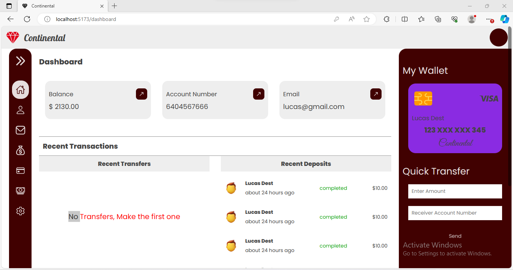
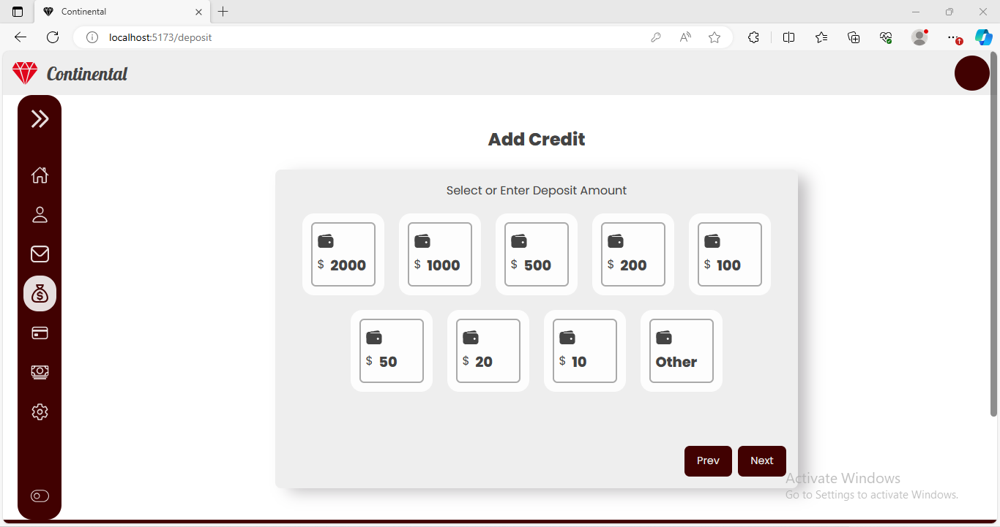
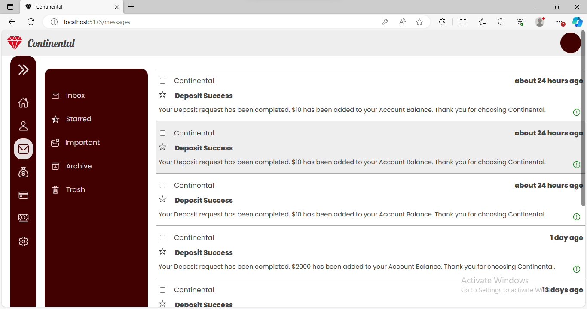
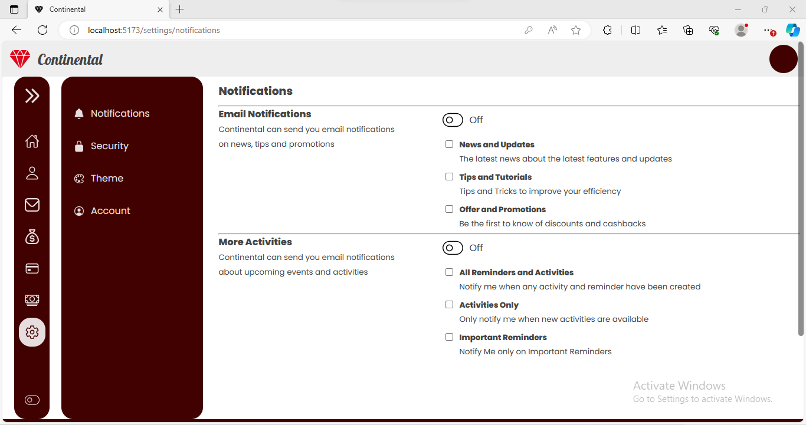

# Continental






## Overview

Welcome to the Continental! This application is built with Vue.js and provides users with the ability to deposit and transfer money. It includes features such as form validation, routing, and route protection state management using Pinia.

## 📃 Features

1. **User Authentication**: Continental also prioritizes robust user authentication through the implementation of JSON Web Tokens (JWT). This adds an extra layer of security to the application. Upon successful login, users are issued a JWT, which serves as a digitally signed and encrypted token

2. **Deposit Money**: Users can deposit funds into their accounts securely using the app. The deposit feature ensures the accuracy of entered amounts and provides real-time updates on the account balance.

3. **Transfer Money**: Continental allows users to transfer money between accounts. With a user-friendly interface, transferring funds is a breeze. The app ensures that the sender has sufficient funds and provides instant confirmation of successful transfers.

4. **Account Number**: Users are given a unique Account Number on successful registration

5. **Form Validation**: Input forms for deposit and transfer are equipped with robust validation mechanisms. Users receive immediate feedback and error messages if they attempt to submit incomplete or incorrect information.

6. **Routing**: The app utilizes Vue Router to manage navigation seamlessly. Users can move between different sections of the app without page reloads, providing a smooth and responsive experience.

7. **Route Protection**: To ensure the security of user data, certain routes are protected. Users need to authenticate or meet specific criteria to access sensitive sections, such as the transfer page. Route protection is implemented using Pinia for efficient state management.

## 🌍 Backend

The Project also has a Backend. Click <a href='https://github.com/solobarine/continental_backend'>here</a> to view the Backend.

## 🖥️ Getting Started

Follow these steps to set up the Continental on your local machine:

1. **Clone the Repository**: Start by cloning this repository to your local machine:

   ```bash
   git clone https://github.com/solobarine/continental.git
   ```

2. **Install Dependencies**: Navigate to the project directory and install the required dependencies using npm or yarn:

   ```bash
   cd continental
   npm install
   ```

3. **Run the Development Server**: Once the dependencies are installed, run the development server:

   ```bash
   npm run serve
   ```

## 💻 Tech Stack

- **Vue.js**: A progressive JavaScript framework for building user interfaces.
- **Vue Router**: The official routing library for Vue.js applications.
- **Pinia**: A state management library for Vue.js applications, used for efficient and scalable state management, particularly for route protection.
- **IonIcons**: Free Open Source Icons

## 👤 Author

- Name: **Solomon Barine Akpuru**
- GitHub: [@solobarine](https://github.com/solobarine)
- LinkedIn: [solomon-akpuru](https://www.linkedin.com/in/solomon-akpuru)

## 🤝 Contribution Guidelines

We welcome contributions to make Continental Financial Web App even better! If you'd like to contribute, please follow these steps:

- Fork the repository.
- Create a new branch for your feature or bug fix.
- Make your changes and test thoroughly.
- Commit your changes and push them to your fork.
- Create a pull request, explaining the changes you've made.

## 🙏 Show your Support

Give a ⭐️ if you like the project!

## 📧 Contact Us

If you have any questions, suggestions, or feedback, please feel free to reach out to our team at <b>solobarine@gmail.com</b>.

## 📝 License

Copyright &copy; Solomon Barine Akpuru. All Rights Reserved

Licensed under the <a href='./LICENSE'>MIT</a>

Thank you for using Continental to manage your finances with ease! We hope you have a great experience.
